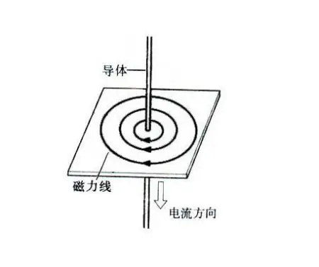

# circuit

## electricity

电流的磁场具有方向，其磁场方向的判断可用安培定则进行判断，即用右手握住导线（导体或电流）使大拇指的指向为电流的流向（电流从正极到负极，大拇指指向负极），此时四指环绕的方向就是磁场的方向。
$$
B = \frac{\mu_0 I}{2\pi r}
$$

$B$为特定点的磁场大小。为常数，常数大小取决于材料的性质，不同材料有不同的常数，真空中的大小为$4π×10^{-7}T·m/A$

$r$是导体到特定点之间的距离。

$I$是导体的电流。

## power system

由发电、变电、输电、配电和用电等环节组成的电能生产与消费系统

1. 发电站：起点，包括火力发电站、水力发电站、核电站、风力发电站、太阳能发电站等。

2. 输电网：主要部分，包括高压输电线路和变电站，用于将电能从发电站输送到负荷中心。

3. 配电网：末端，包括配电线路和配电变电站，用于将电能从负荷中心输送到用户。

4. 电力用户：终点，包括工业用户、商业用户和居民用户。

## learn_software

### Digital

https://github.com/hneemann/Digital

"Digital" 是一款专注于数字逻辑电路设计和模拟的软件，它的主要优点和缺点如下：

优点：

1. 强大的电路设计和模拟功能：你可以使用 "Digital" 来设计复杂的数字逻辑电路，并模拟它们的运行。

2. 自定义封装："Digital" 允许你创建自定义的电路元件，这使得你可以模拟各种不同的电路和设备。

3. 开源和免费："Digital" 是一个开源项目，你可以免费使用它，甚至可以查看和修改它的源代码。

缺点：

1. 不支持 PCB 设计："Digital" 主要专注于电路设计和模拟，它不提供 PCB 设计功能。如果你需要设计 PCB，你可能需要使用其他的软件，如 KiCad 或 Eagle。

2. 用户界面可能不够友好：对于初学者来说，"Digital" 的用户界面可能稍显复杂。

总的来说，"Digital" 是一款非常强大的电路设计和模拟软件，但它并不适合所有的应用。如果你需要设计 PCB，你可能需要使用其他的软件。

#### start

### KiCad
